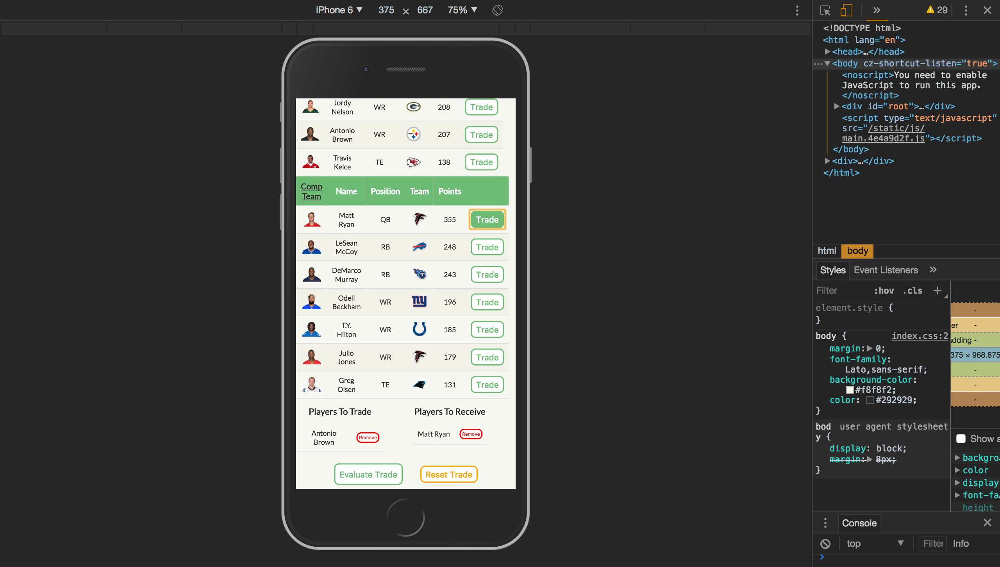

# Who Gon Swap Me

### Simulate fantasy football trades by evaluating your players against the computer team's players

### Live Version
You can find a live version of this application on Heroku at: https://whogonswapme.herokuapp.com/

## Overview
* This app is built with React and is consuming Rails API for its data.

* The API can be found on [GitHub](https://github.com/bschwartz10/the_intimidation_game) and or live at https://the-intimidation-game.herokuapp.com

* The app is designed using HTML5 and CSS Grid Layout. Media queries were included in the design to make the app fully mobile responsive.

### Setup
To set up a local copy of this project, perform the following:

  1. Clone the repository: `git clone https://github.com/bschwartz10/who_gon_swap_me`
  2. `cd` into the project's directory
  3. Run `npm install`
  4. Run `npm start`
  5. Visit `http://localhost:3000/`

### Dependencies
This application depends on npm packages, all of which are found in the `package.json` and can be installed by running `npm install` from the terminal in the main directory of the project.

### Design
The app is split into seven separate components:

App - Top level component
- Responsible for external API call to collect team/player information
- Handles adding and removing players from a trade

Team - Represents one team
- Renders HTML table with stat categories
- Creates a Player component which a JSON object

Player - Represents one player
- Fills each row of the Team table with a player

PlayersToCompare - Creates a TradedPlayer component for each player that is active in current trade

TradedPlayer - Represents players active in current trade

TradeResult - Trade result screen
- Renders a positive or negative outcome dependent on the trade result

EvaluateButton - Computes trade outcome based on player statistics

### Discussion
The goal of this application is to create a SPA for fantasy football trades. The UI for fantasy football trades on the popular platforms right now requires multiple screen refreshes and page loads. This app was built as a minimum viable product to simulate how the current UI could be streamlined.

The components were built to maximize reusability. Both teams use the same Team and Player components to create their markup. The TradedPlayer component functions for both teams as well and determines which team the player is on based on a teamId prop.

The app is consuming a Rails API for its team/player data. Right now the App component is making two API calls within the componentDidMount method to retrieve the data for each team. The API can probably be better restructured so the the App component is only required to make one API call which would increase performance.

The app currently doesn't have any tests. I was given a short time period to build this application and it was my first time building an app in React. Due to those circumstances, I decided to hold off testing until a later point. I don't prefer this workflow and moving forward I plan on TDD'ing my React apps.

### Next Steps
The UI is lacking in many areas for this application. After a trade is evaluated, the players aren't moved to the other team. A logical next step would be to incorporate the functionality for the players to be actually traded to the other team. Also, the TradeResult component needs to be redesigned to render a better looking result.

I used CSS grid layout to style the app. Some browsers aren't fully compatible with CSS grid layout and the design doesn't render correctly. The styling needs to be updated to be compatible with older technologies.

The next major feature I plan to implement would give the user the option to choose what team to trade with. This would require the app to preload twelve teams and give the user a dropdown option to decide what team they would like to trade with.

### Contributors:
* [Brett Schwartz](https://github.com/bschwartz10)
