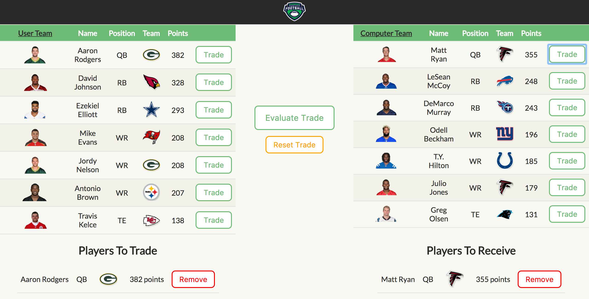

# Who Gon Swap Me

### Simulate fantasy football trades by evaluating your players against the computer team's players

### Live Version

You can find a live version of this application on Heroku at: https://fftm.herokuapp.com/

## Overview

* This app is built with React and is consuming Rails API for its data.

* The API can be found on [GitHub](https://github.com/bschwartz10/the_intimidation_game) and or live at https://the-intimidation-game.herokuapp.com

### Setup

To set up a local copy of this project, perform the following:

  1. Clone the repository: `git clone https://github.com/bschwartz10/fftm`
  2. `cd` into the project's directory
  3. Run `npm install`
  4. Run `npm start`
  5. Visit `http://localhost:3000/`

### Design
The app is designed using HTML5 and CSS Grid Layout

### Dependencies

This application depends on npm packages, all of which are found in the `package.json` and can be installed by running `npm install` from the terminal in the main directory of the project.

### Contributors:
* [Brett Schwartz](https://github.com/bschwartz10)
